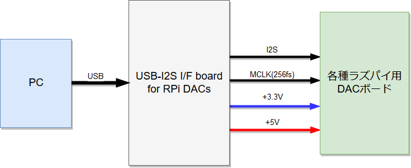
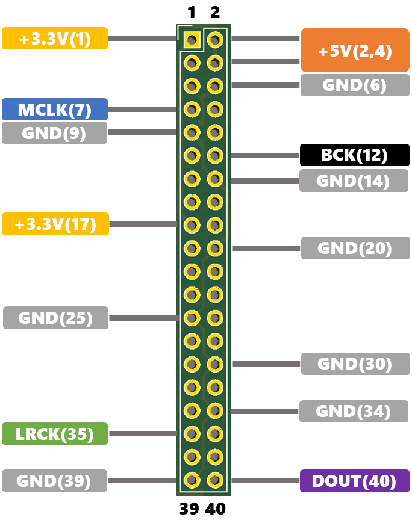

## これは何?
Raspberry Pi用のDACボードをUSBオーディオデバイスとして使用できるようにするボードです。

## 特徴
- Raspberry Piと互換性のある形状のため、Raspberry Pi用のケースを使う事が出来ます。
- DACボードに電源供給もできるため、Raspberry Piから電源供給が必要なDACボードも使用できます。(+3.3Vはシリーズレギュレータ電源のため、オーディオ用途に適します。)
- Raspberry Piでは供給されないMCLK信号も出力します
- 各クロックはオーディオ専用DAIチップから供給されるため、Raspberry PiのSoC内蔵PLL由来の周期ジッタの心配がありません
- 電源の逆流防止回路を搭載しているため、Raspberry Pi本体にも電源供給を行うタイプのDACボードでも使用できます。また、お手持ちの高品質電源をそのまま使用できます。
- USBからのVbus電源の補助として+5V電源を外部入力できます。

## 仕様
- 使用チップ：PCM2706
- サンプルレート：32k, 44.1k, 48k 16bit (PCM2706の仕様に準拠)
- 出力フォーマット：I2S(64fs)
- MCLKクロック：256fs(GPIO4, Pin7から出力)
- 電源出力：+3.3V, +5V
- DACインターフェース：Raspberry Pi GPIO互換配置

.png)

