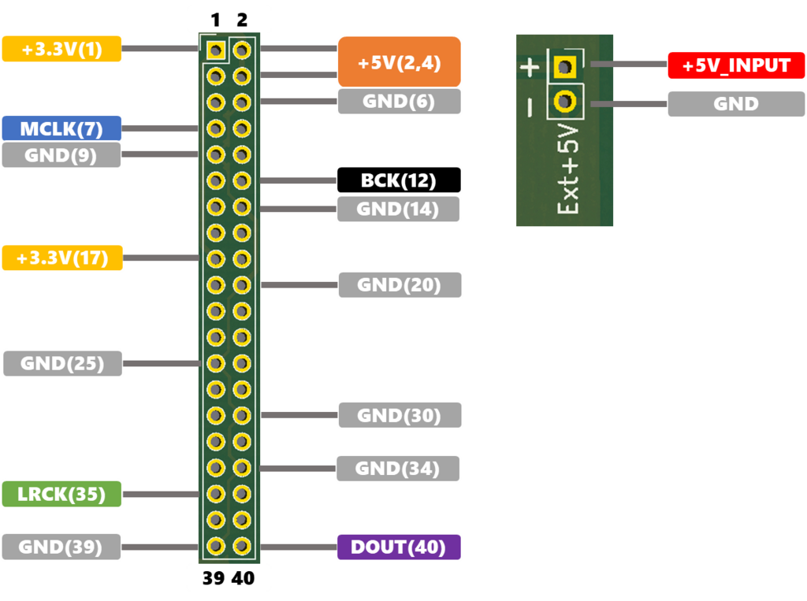

## これは何?
Raspberry Pi用のDACボードをUSBオーディオデバイスとして使用できるようにするボードです。

## 特徴
- Raspberry Piと互換性のある形状のため、Raspberry Pi用のケースを使う事が出来ます。
- DACボードに電源供給もできるため、Raspberry Piから電源供給が必要なDACボードも使用できます。(+3.3Vはシリーズレギュレータ電源のため、オーディオ用途に適します。)
- Raspberry Piでは供給されないMCLK信号も出力します
- 各クロックはオーディオ専用DAIチップから供給されるため、Raspberry PiのSoC内蔵PLL由来の周期ジッタの心配がありません
- 電源の逆流防止回路を搭載しているため、Raspberry Pi本体にも電源供給を行うタイプのDACボードでも使用できます。また、お手持ちの高品質電源をそのまま使用できます。
- USBからのVbus電源の補助として+5V電源を外部入力できます。

## 仕様
- 使用チップ：PCM2706
- サンプルレート：32k, 44.1k, 48k 16bit (PCM2706の仕様に準拠)
- 出力フォーマット：I2S(64fs)
- MCLKクロック：256fs(GPIO4, Pin7から出力)
- 電源出力：+3.3V, +5V(300mA以下を推奨)
- DACインターフェース：Raspberry Pi GPIO互換配置

.png)

## What is this?
DAC board for Raspberry Pi usable as a USB audio device.

## Characteristic
- You can use the case for Raspberry Pi, Because of the shape compatible with Raspberry Pi.
- Since it can also supply power to the DAC board, you can use a DAC board that requires power supply from Raspberry Pi. (+ 3.3 V is suitable for audio applications because it is a series regulator power supply.)
- Output MCLK signal
- Since each clock is supplied from a dedicated audio DAI chip, the period jitter derived from the Raspberry Pi SoC embedded PLL is not worried
- It has a circuit to prevent reverse current of the power supply, it can be used for a type of DAC board that supplies power to the raspberry pie itself. Moreover, you can use your high quality power supply as it is.
- A + 5V power supply can be input externally as an aid to the Vbus power supply from the USB.

## Spec
- DAI Chip：PCM2706
- Sample rate：32k, 44.1k, 48k 16bit (Compliant with PCM2706 specification)
- Output format：I2S(64fs)
- MCLK clock：256fs(GPIO4, Pin7から出力)
- Power Supply：+3.3V, +5V(~300mA)
- DAC I/F：Raspberry Pi GPIO互換配置
